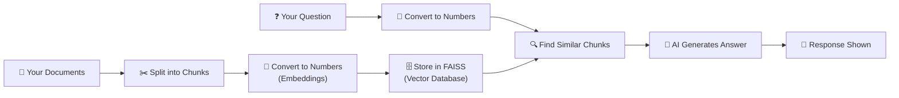

# 🤖 RAG Chatbot — Application Report

**Course:** Makers Lab (Term 3) | **Institute:** SPJIMR  
**Date:** February 10, 2026

---

## 1. What Is This Application?

This is an **AI-powered chatbot** that can answer questions by reading through your own documents. Instead of searching the internet, it looks through a personal "knowledge base" — a folder of text files you provide — and gives you accurate, sourced answers.

Think of it like having a **personal assistant who has read all your documents** and can instantly recall information from them when you ask a question.

---

## 2. The Core Idea: RAG (Retrieval-Augmented Generation)

**RAG** stands for **Retrieval-Augmented Generation**. In simple terms, it combines two steps:

| Step | What Happens | Analogy |
|------|-------------|---------|
| **1. Retrieval** | The system searches your documents and finds the most relevant paragraphs related to your question | Like flipping through a textbook to find the right page |
| **2. Generation** | An AI model reads those paragraphs and writes a clear, human-like answer | Like a student summarizing what they found in their own words |

> [!IMPORTANT]
> The AI **only answers from your documents** — it does not make things up or pull information from the internet. If the answer isn't in your files, it will tell you.

---

## 3. How It Works (Step by Step)



### Breaking it down:

1. **You add documents** — Place `.txt` files in the `knowledge_base` folder (e.g., company policies, notes, research papers)

2. **Documents are split** — Large files are broken into smaller, manageable pieces called "chunks" (like cutting a book into individual pages)

3. **Chunks become numbers** — Each chunk is converted into a list of numbers (called an "embedding") that captures its meaning. This is done by an **Embedding Model** running on HuggingFace's servers

4. **Numbers are stored** — These numerical representations are saved in a **FAISS database** (a fast search engine for numbers)

5. **You ask a question** — Your question is also converted into numbers the same way

6. **Similar chunks are found** — The system compares your question's numbers with all the chunk numbers to find the closest matches (like finding the most relevant pages)

7. **AI writes the answer** — The matching chunks are sent to a **Language Model (LLM)** which reads them and generates a clear, natural-language answer

---

## 4. Key Features

### 📚 Custom Knowledge Base
- Add any `.txt` files to the `knowledge_base` folder
- Reload anytime using the sidebar button
- Currently loaded with 6 documents (profile, experience, skills, projects, achievements, goals)

### 🤖 Multiple AI Models
The app lets you choose from different AI models:

| Model | Best For |
|-------|----------|
| Mistral 7B Instruct | General-purpose, reliable |
| Zephyr 7B | Conversational, friendly |
| Phi-3 Mini | Fast, efficient |
| Llama 3.2 3B | Meta's latest compact model |
| Gemma 2 2B | Google's lightweight model |

### 🔍 Configurable Retrieval
- **Chunk Size** (500–2000): Controls how big each document piece is
- **Number of Results** (1–5): How many relevant pieces to retrieve

### 📄 Source Citations
Every answer includes an expandable section showing exactly which document fragments were used — so you can verify the answer.

### ⚡ 100% Free
All processing happens via HuggingFace's free Inference API — no paid subscriptions or expensive GPU hardware needed.

### 💬 Chat History
The app remembers your conversation, so you can ask follow-up questions naturally.

---

## 5. Technology Stack

| Component | Technology | Role |
|-----------|-----------|------|
| User Interface | **Streamlit** | Creates the web-based chat interface |
| Document Loading | **LangChain** | Reads and processes text files |
| Text Splitting | **RecursiveCharacterTextSplitter** | Breaks documents into chunks intelligently |
| Embeddings | **HuggingFace API** (e.g., all-MiniLM-L6-v2) | Converts text into numerical representations |
| Vector Database | **FAISS** (Facebook AI Similarity Search) | Stores and searches embeddings efficiently |
| Answer Generation | **HuggingFace Inference API** | Runs the LLM to generate answers |
| Environment Mgmt | **python-dotenv** | Manages configuration securely |

---

## 6. How to Use the Application

### First-Time Setup
1. **Get a free HuggingFace account** at [huggingface.co](https://huggingface.co/join)
2. **Create a token** at [Settings → Tokens](https://huggingface.co/settings/tokens)
   - Choose **"Fine-grained"** type
   - Enable **"Make calls to Inference Providers"**
3. **Install dependencies**: `pip install -r requirements.txt`
4. **Add documents** to the `knowledge_base/` folder

### Running the App
```
streamlit run app.py
```
Then open `http://localhost:8501` in your browser.

### Asking Questions
1. Paste your HuggingFace token in the sidebar
2. Wait for the knowledge base to load (green ✅ confirmation)
3. Type your question in the chat box
4. View the AI-generated answer and optionally expand source documents

---

## 7. Project File Structure

```
ApplicationTest1/
├── app.py                  ← Main application (320 lines)
├── requirements.txt        ← Python package dependencies
├── .env                    ← Stores your HuggingFace token
├── README.md               ← Quick-start guide
├── knowledge_base/         ← Your documents go here
│   ├── profile.txt
│   ├── experience.txt
│   ├── skills.txt
│   ├── projects.txt
│   ├── achievements.txt
│   └── goals.txt
└── venv_rag/               ← Python virtual environment
```

---

## 8. Error Handling

The application includes user-friendly error handling:

| Error | What It Means | Solution |
|-------|--------------|----------|
| **403 Forbidden** | Token doesn't have correct permissions | Recreate token with "Inference Providers" enabled |
| **Model loading** | AI model is starting up on the server | Wait 20–30 seconds and retry |
| **No documents found** | Knowledge base folder is empty | Add `.txt` files and reload |
| **Embedding error** | Issue converting text to numbers | Check token and selected model |

---

## 9. Key Takeaways

> [!TIP]
> **Why RAG matters:** Traditional AI models can "hallucinate" — make up information. RAG solves this by grounding AI answers in your actual documents, making it far more reliable for business and academic use.

- **RAG = Search + AI** — Combines document retrieval with AI generation
- **Your data stays private** — Documents are processed in your session only
- **Completely free** — No paid APIs, no GPU required
- **Customizable** — Swap models, tune chunk sizes, change the knowledge base anytime
- **Transparent** — Always shows which sources were used for each answer

---

*Report prepared for Makers Lab, SPJIMR — Term 3*
